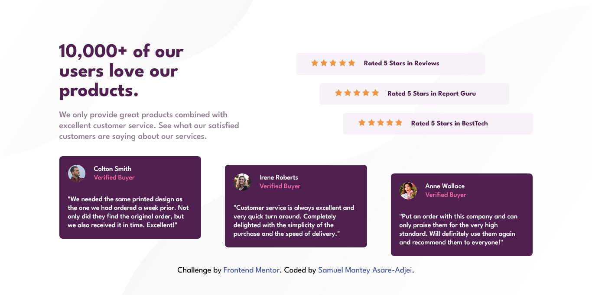

# Frontend Mentor - Social proof section solution

This is a solution to the [Social proof section challenge on Frontend Mentor](https://www.frontendmentor.io/challenges/social-proof-section-6e0qTv_bA). Frontend Mentor challenges help you improve your coding skills by building realistic projects. 

## Table of contents

- [Overview](#overview)
  - [The challenge](#the-challenge)
  - [Screenshot](#screenshot)
  - [Links](#links)
- [My process](#my-process)
  - [Built with](#built-with)
  - [What I learned](#what-i-learned)
  - [Useful resources](#useful-resources)
- [Author](#author)


## Overview

### The challenge

Users should be able to:

- View the optimal layout for the section depending on their device's screen size

### Screenshot




### Links

- Solution URL: [Add solution URL here](https://your-solution-url.com)
- Live Site URL: [social-proof-section-master](https://sam-mantey.github.io/Social-proof-section-master/)

## My process

### Built with

- Semantic HTML5 markup
- CSS custom properties
- Flexbox
- CSS Grid

### What I learned

I Learned how to set the background of a page. I also learnt how to give a page or an element two different backgorund images.


```css
 body {
    background: url('images/bg-pattern-top-mobile.svg') left top no-repeat, url('images/bg-pattern-bottom-mobile.svg') right bottom no-repeat;
  }
```

The CSS code above gives the body element two background images. The first one set to the top-left corner and the second one to the bottom-right corner.


### Useful resources

- [Multiple background ](https://www.w3schools.com/css/css3_backgrounds.asp) - This helped me know how to insert multiple backgrounds.


## Author

- Website - [Samuel Mantey Asare-Adjei](https://www.your-site.com)
- Frontend Mentor - [@sam_mantey](https://www.frontendmentor.io/profile/sam_mantey)
- Twitter - [@sam_mantey](https://www.twitter.com/sam_mantey)
